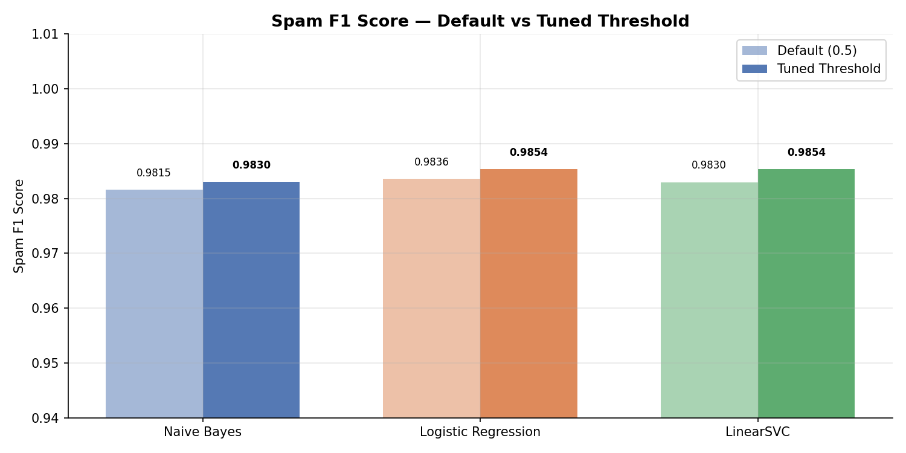
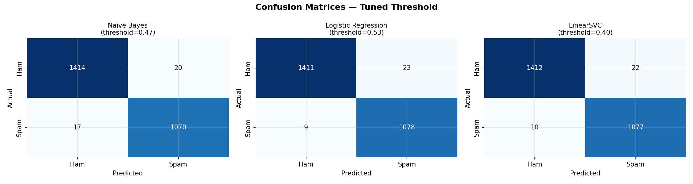
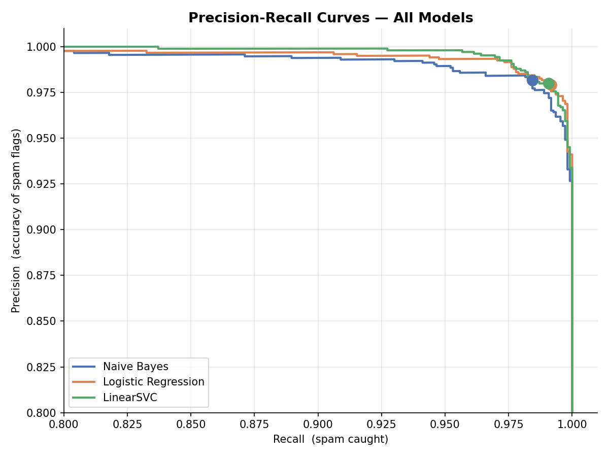
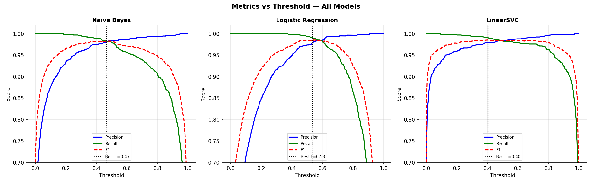

# 🛡️ MailGuard — ML-Powered Email Spam Classifier

A professional machine learning project that classifies emails as spam or ham using three models simultaneously, with threshold tuning, model comparison, and an interactive Streamlit web app.

---

## 📊 Results

| Model | Accuracy | Ham F1 | Spam F1 | Best Threshold |
|---|---|---|---|---|
| Naive Bayes | 98.53% | 0.99 | 0.9830 | 0.4664 |
| Logistic Regression | **98.73%** | **0.99** | **0.9854** | 0.5337 |
| LinearSVC | **98.73%** | **0.99** | **0.9854** | 0.4045 |

> **Best model: Logistic Regression** — highest spam F1 after threshold tuning, perfect ham precision (1.00) meaning zero legitimate emails wrongly flagged.

---

## 🚀 Features

- **3 ML models** compared side by side — Naive Bayes, Logistic Regression, LinearSVC
- **Threshold tuning** — finds optimal decision threshold per model using F1 maximization on the precision-recall curve
- **Two input modes** — paste email text or upload `.txt` / `.eml` files
- **Auto & Manual threshold modes** — use tuned thresholds or adjust sensitivity manually via slider
- **Explainability** — shows top TF-IDF tokens that triggered the spam classification
- **Majority vote verdict** — final decision based on agreement across all 3 models
- **4 evaluation charts** — F1 comparison, confusion matrices, PR curves, metrics vs threshold

---

## 🗂️ Project Structure

```
MailGuard/
│
├── data/                        # Dataset files (download separately)
│   ├── lingSpam.csv
│   └── enronSpamSubset.csv
│
├── src/
│   ├── preprocess.py            # Load, clean, TF-IDF, save splits
│   ├── naive_bayes.py           # Train + save Naive Bayes
│   ├── logistic_regression.py   # Train + save Logistic Regression
│   └── linear_svc.py            # Train + save LinearSVC
│
├── models/                      # Saved model files
│   ├── vectorizer.pkl
│   ├── data_split.pkl
│   ├── naive_bayes.pkl
│   ├── logistic_regression.pkl
│   └── linear_svc.pkl
│
├── reports/
│   └── figures/                 # Generated evaluation charts
│       ├── f1_comparison.png
│       ├── confusion_matrices.png
│       ├── pr_curves.png
│       └── metrics_vs_threshold.png
│
├── evaluate.py                  # Model comparison + threshold tuning + charts
├── app.py                       # Streamlit web app
├── requirements.txt
└── README.md
```

---

## ⚙️ How to Run

### 1. Clone the repository
```bash
git clone https://github.com/yourusername/mailguard.git
cd mailguard
```

### 2. Install dependencies
```bash
pip install -r requirements.txt
```

### 3. Option A — Use pre-trained models (fastest)
Models are included in the `models/` folder. Skip straight to the app:
```bash
streamlit run app.py
```

### 4. Option B — Retrain from scratch
Download the datasets and place them in `data/`:
- [LingSpam Dataset](https://www.kaggle.com/datasets/mandygu/lingspam-dataset)
- [Enron Spam Dataset](https://www.kaggle.com/datasets/wanderfj/enron-spam)

Then run in order:
```bash
python src/preprocess.py
python src/naive_bayes.py
python src/logistic_regression.py
python src/linear_svc.py
python evaluate.py
streamlit run app.py
```

---

## 🧠 Methodology

### Dataset
Combined two datasets for 12,605 emails total:
- **LingSpam** (2,605 emails) — 83% ham / 17% spam, academic emails
- **Enron Spam Subset** (10,000 emails) — 50% ham / 50% spam, corporate emails

The combination results in a mild imbalance (57% ham / 43% spam) that mirrors realistic conditions.

### Feature Extraction — TF-IDF
```
TF-IDF (Term Frequency — Inverse Document Frequency)
├── max_features : 10,000
├── ngram_range  : (1, 2)  — single words + pairs ("click here", "free offer")
├── stop_words   : english
├── min_df       : 2       — ignore words appearing in only 1 email  
├── sublinear_tf : True    — dampen high word counts
└── token_pattern: [a-zA-Z]{3,}  — letters only, minimum 3 chars
```

### Models
| Model | Key Parameters | Why |
|---|---|---|
| MultinomialNB | default | Handles text naturally, no imbalance adjustment needed |
| LogisticRegression | `class_weight='balanced'`, `max_iter=1000` | Best overall, compensates for class imbalance |
| LinearSVC (Calibrated) | `class_weight='balanced'` | Wrapped with `CalibratedClassifierCV` for probability output |

### Threshold Tuning
Default threshold (0.5) is rarely optimal. For each model:
1. Extract spam probabilities via `predict_proba`
2. Compute precision, recall, F1 at every possible threshold using `precision_recall_curve`
3. Select threshold that maximises F1 score via `np.argmax`

This improved Spam F1 across all three models, with LinearSVC seeing the largest gain (+0.0024).

---

## 📈 Evaluation Charts

### F1 Comparison — Default vs Tuned


### Confusion Matrices


### Precision-Recall Curves


### Metrics vs Threshold


---

## 🛠️ Tech Stack

| Tool | Purpose |
|---|---|
| `scikit-learn` | TF-IDF, all 3 models, evaluation metrics |
| `pandas / numpy` | Data handling |
| `matplotlib / seaborn` | Evaluation charts |
| `streamlit` | Web application |
| `joblib` | Model serialization |

---

## 💡 Key Learnings

- Naive Bayes handles class imbalance naturally through prior probabilities — no `class_weight` needed
- Logistic Regression and LinearSVC require `class_weight='balanced'` to avoid predicting majority class
- LinearSVC doesn't output probabilities natively — wrapping with `CalibratedClassifierCV` is required for threshold tuning
- Default threshold (0.5) is not always optimal — threshold tuning improved all 3 models
- Dataset balance significantly affects model behaviour — combining datasets with different balance levels produces more robust models

---

## 📄 License

MIT License — free to use, modify, and distribute.
